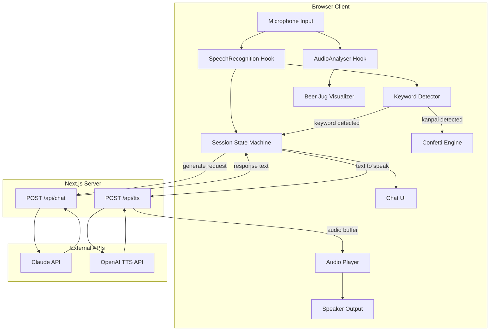
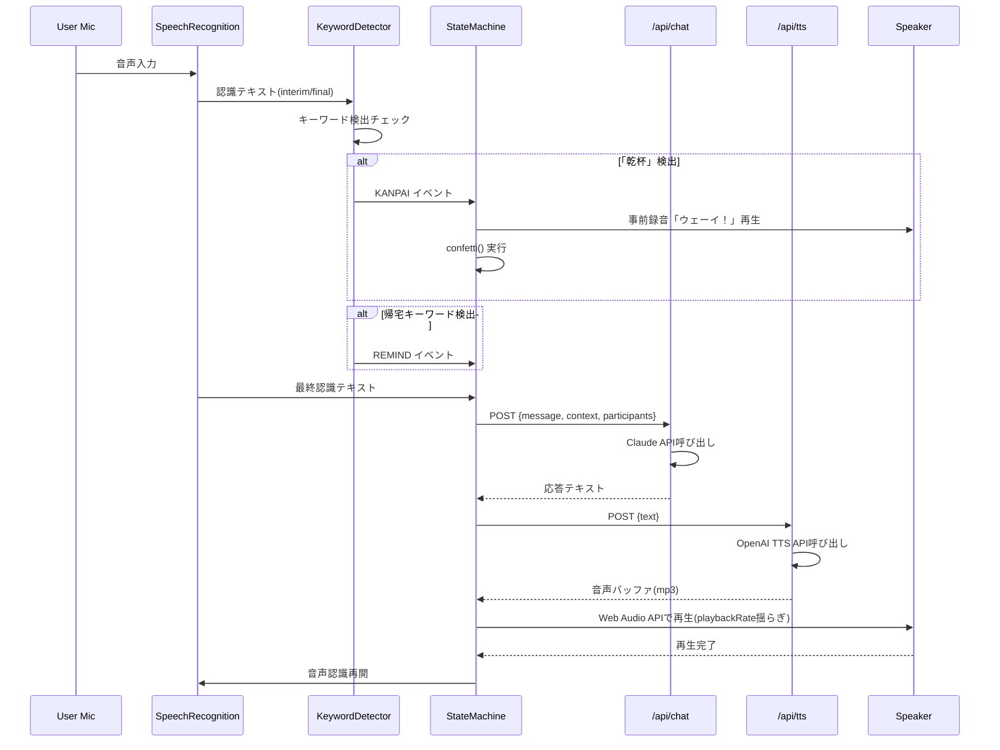
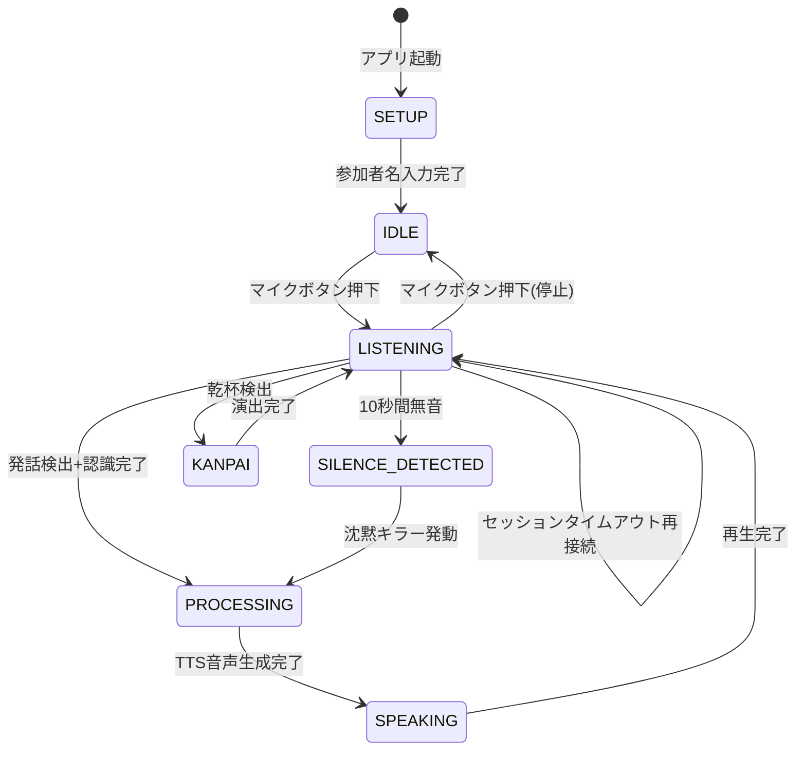

# Technical Design: Yo-i Facilitator

## Overview

**Purpose**: 飲み会の場で酔っ払いAIキャラクター「ヨイさん」がファシリテーションを行い、発言の偏り・沈黙・切り上げの難しさを解消するWebアプリケーションを提供する。

**Users**: 飲み会参加者がChromeブラウザでアクセスし、マイク入力とスピーカー出力を通じてヨイさんと対話する。

**Impact**: 音声認識→AI応答生成→音声合成のリアルタイムループと、キーワード検出による自動介入により、既存のテキストチャットAIとは異なる音声ベースのインタラクティブ体験を実現する。

### Goals
- 音声入力からAI応答の音声再生まで3秒以内のリアルタイムループ
- 酔っ払いキャラクター「ヨイさん」の一貫したペルソナ維持
- 「乾杯」検出→クラッカー演出を1秒以内に実行
- 居酒屋の暗い環境でも視認性の高いダークモードUI

### Non-Goals
- 話者ダイアリゼーション（Web Speech APIの制約により不可）
- マルチデバイス同期（単一PC上での動作のみ）
- 会話データの永続化（ハッカソンスコープ外、セッション内のみ保持）
- ユーザー認証

## Architecture

### Architecture Pattern & Boundary Map



**Architecture Integration**:
- **Selected pattern**: クライアント中心型 — 音声認識はブラウザネイティブAPI、サーバーは外部API呼び出しのプロキシのみ
- **Domain boundaries**: クライアント（音声I/O・状態管理・UI）とサーバー（LLM/TTSプロキシ）の2層
- **Existing patterns preserved**: Next.js App Router規約、Route Handlers、`src/lib/`でのサービスクライアント管理
- **Steering compliance**: Server Componentsデフォルト、`'use client'`は音声・UIコンポーネントのみ

### Technology Stack

| Layer | Choice / Version | Role in Feature | Notes |
|-------|------------------|-----------------|-------|
| Frontend | React 19 + Next.js 16 | UI、状態管理、Client Components | App Router |
| 音声認識 | Web Speech API (webkitSpeechRecognition) | ブラウザネイティブSTT | Chrome専用、無料 |
| 音声レベル | Web Audio API (AudioContext + AnalyserNode) | 発話量計測 | マイクストリーム並行取得 |
| 視覚演出 | canvas-confetti 1.9.x | 乾杯クラッカー演出 | 6KB gzipped |
| LLM | @anthropic-ai/sdk (Claude API) | ヨイさん応答生成 | 既存セットアップ済み |
| TTS | OpenAI TTS API (tts-1) | 音声合成 | speed: 0.8、300-500ms初回バイト |
| 音声エフェクト | Web Audio API (AudioBufferSourceNode) | playbackRate揺らぎ | 0.95-1.05 |
| Styling | Tailwind CSS v4 | ダークモードUI | 既存セットアップ済み |
| Infrastructure | Vercel (Fluid Compute) | デプロイ・ホスティング | HTTPS自動 |

## System Flows

### メインインタラクションループ



### 状態遷移



## Requirements Traceability

| Requirement | Summary | Components | Interfaces | Flows |
|-------------|---------|------------|------------|-------|
| 1.1-1.5 | リアルタイム音声認識 | SpeechRecognitionHook | useSpeechRecognition | メインループ |
| 2.1-2.3 | ビールジョッキUI | AudioAnalyserHook, BeerJugVisualizer | useAudioAnalyser | — |
| 3.1-3.3 | 未発話者パス出し | FacilitationEngine, SessionStateProvider | FacilitationTrigger | メインループ |
| 4.1-4.3 | 沈黙キラー | FacilitationEngine, SessionStateProvider | FacilitationTrigger | 状態遷移 |
| 5.1-5.3 | 乾杯演出 | KeywordDetector, ConfettiEffect | KanpaiEvent | メインループ |
| 6.1-6.2 | 終電リマインド | KeywordDetector, FacilitationEngine | FacilitationTrigger | メインループ |
| 7.1-7.2 | 生理現象ケア | FacilitationEngine, SessionStateProvider | FacilitationTrigger | — |
| 8.1-8.5 | AI応答生成 | ChatAPIRoute, YoiPromptBuilder | POST /api/chat | メインループ |
| 9.1-9.4 | 音声合成 | TTSAPIRoute, AudioPlayerHook | POST /api/tts, useAudioPlayer | メインループ |
| 10.1-10.5 | 会話UI・ダークモード | ChatPanel, MessageBubble, MicStatusIndicator, YoiAvatar | — | — |
| 11.1-11.4 | デプロイ・インフラ | 環境変数設定、Vercelデプロイ | — | — |

## Components and Interfaces

| Component | Domain/Layer | Intent | Req Coverage | Key Dependencies | Contracts |
|-----------|-------------|--------|-------------|-----------------|-----------|
| SpeechRecognitionHook | Client/Audio | Web Speech APIラッパー | 1.1-1.5 | webkitSpeechRecognition (P0) | State |
| AudioAnalyserHook | Client/Audio | マイク音量計測 | 2.1-2.3 | AudioContext (P0) | State |
| KeywordDetector | Client/Logic | 認識テキストからキーワード検出 | 5.1-5.3, 6.1-6.2 | SpeechRecognitionHook (P0) | Event |
| FacilitationEngine | Client/Logic | トリガー条件判定・介入判断 | 3.1-3.3, 4.1-4.3, 6.1-6.2, 7.1-7.2 | SessionStateProvider (P0) | Service |
| SessionStateProvider | Client/State | セッション全体の状態管理 | 全Requirements | React Context (P0) | State |
| AudioPlayerHook | Client/Audio | TTS音声再生+エフェクト | 9.1-9.4 | Web Audio API (P0) | State |
| ChatAPIRoute | Server/API | Claude API呼び出しプロキシ | 8.1-8.5 | @anthropic-ai/sdk (P0) | API |
| TTSAPIRoute | Server/API | OpenAI TTS API呼び出しプロキシ | 9.1-9.2 | OpenAI TTS API (P0) | API |
| BeerJugVisualizer | Client/UI | ビールジョッキアニメーション | 2.1-2.3 | AudioAnalyserHook (P1) | — |
| ConfettiEffect | Client/UI | canvas-confettiラッパー | 5.1 | canvas-confetti (P1) | — |
| ChatPanel | Client/UI | チャット表示エリア | 10.1-10.3 | — | — |
| MessageBubble | Client/UI | メッセージ吹き出し | 10.2-10.3 | — | — |
| YoiAvatar | Client/UI | ヨイさんアバター画像表示 | 10.4 | — | — |
| MicStatusIndicator | Client/UI | マイク状態表示 | 10.5 | SpeechRecognitionHook (P1) | — |
| SetupScreen | Client/UI | 参加者名入力画面 | 3.2 | — | — |

### Client / Audio Layer

#### SpeechRecognitionHook

| Field | Detail |
|-------|--------|
| Intent | Web Speech APIを抽象化し、リアルタイム音声認識機能を提供するカスタムフック |
| Requirements | 1.1, 1.2, 1.3, 1.4, 1.5 |

**Responsibilities & Constraints**
- `webkitSpeechRecognition`のライフサイクル管理（開始・停止・再接続）
- セッションタイムアウト時の自動再接続（100-300ms遅延）
- React 19 Strict Modeでの二重起動防止（refフラグ使用）

**Dependencies**
- External: webkitSpeechRecognition — ブラウザネイティブAPI (P0)

**Contracts**: State [x]

##### State Management
```typescript
interface SpeechRecognitionState {
  isListening: boolean;
  transcript: string;
  interimTranscript: string;
  error: SpeechRecognitionErrorType | null;
}

type SpeechRecognitionErrorType =
  | "not-allowed"
  | "no-speech"
  | "audio-capture"
  | "network"
  | "service-not-available";

interface UseSpeechRecognitionReturn extends SpeechRecognitionState {
  startListening: () => void;
  stopListening: () => void;
  resetTranscript: () => void;
}
```

**Implementation Notes**
- `useRef`でrecognitionインスタンスとisStartedフラグを保持
- `onend`でdesiredListening状態チェック→自動再開
- `lang: "ja-JP"`, `continuous: true`, `interimResults: true`

#### AudioAnalyserHook

| Field | Detail |
|-------|--------|
| Intent | マイク音量レベルをリアルタイムで計測し、発話量データを提供 |
| Requirements | 2.1, 2.2, 2.3 |

**Dependencies**
- External: AudioContext + AnalyserNode — Web Audio API (P0)
- External: navigator.mediaDevices.getUserMedia — マイクストリーム取得 (P0)

**Contracts**: State [x]

##### State Management
```typescript
interface AudioAnalyserState {
  volumeLevel: number;       // 0.0-1.0 正規化音量
  totalSpeechTime: number;   // 累積発話時間（秒）
  isSpeaking: boolean;       // 現在発話中か（閾値ベース）
}

interface UseAudioAnalyserReturn extends AudioAnalyserState {
  startAnalysing: () => void;
  stopAnalysing: () => void;
}
```

**Implementation Notes**
- `requestAnimationFrame`ループで`getByteFrequencyData()`を読み取り
- 音量閾値（例: 0.15）を超えた場合にisSpeaking=true、発話時間を累積
- SpeechRecognitionと同じマイクを独立して使用（競合なし）

#### AudioPlayerHook

| Field | Detail |
|-------|--------|
| Intent | TTS音声バッファを受け取り、Web Audio APIエフェクト付きで再生 |
| Requirements | 9.1, 9.2, 9.3, 9.4 |

**Dependencies**
- External: AudioContext + AudioBufferSourceNode — Web Audio API (P0)

**Contracts**: State [x]

##### State Management
```typescript
interface AudioPlayerState {
  isPlaying: boolean;
  progress: number;  // 0.0-1.0
}

interface UseAudioPlayerReturn extends AudioPlayerState {
  playAudio: (audioBuffer: ArrayBuffer) => Promise<void>;
  stopAudio: () => void;
}
```

**Implementation Notes**
- `decodeAudioData`でArrayBuffer→AudioBuffer変換
- `playbackRate`をリクエストごとに0.95-1.05のランダム値に設定（酔っ払い揺らぎ）
- エフェクトチェーン: BufferSource → BiquadFilter(lowshelf, 周波数調整) → Gain → Destination
- 再生完了は`onended`イベントで検知

### Client / Logic Layer

#### KeywordDetector

| Field | Detail |
|-------|--------|
| Intent | 認識テキストからキーワードを検出し、対応イベントを発火 |
| Requirements | 5.1, 5.2, 5.3, 6.1, 6.2 |

**Dependencies**
- Inbound: SpeechRecognitionHook — interimTranscript/transcript (P0)

**Contracts**: Event [x]

##### Event Contract
```typescript
type KeywordEvent =
  | { type: "KANPAI" }
  | { type: "GO_HOME"; keyword: string }
  | { type: "GENERIC_KEYWORD"; keyword: string };

interface KeywordConfig {
  kanpaiKeywords: string[];        // ["乾杯", "かんぱい"]
  goHomeKeywords: string[];        // ["終電", "明日", "何時", "駅"]
}
```

**Implementation Notes**
- interimTranscriptをリアルタイムで検査（乾杯は即座に反応する必要があるため）
- 検出後のクールダウン（例: 5秒）で重複発火防止

#### FacilitationEngine

| Field | Detail |
|-------|--------|
| Intent | タイマーと会話状態に基づきAI介入のトリガー条件を判定 |
| Requirements | 3.1, 3.2, 3.3, 4.1, 4.2, 4.3, 6.1, 6.2, 7.1, 7.2 |

**Dependencies**
- Inbound: SessionStateProvider — セッション状態 (P0)
- Inbound: KeywordDetector — キーワードイベント (P0)
- Outbound: ChatAPIRoute — AI応答リクエスト (P0)

**Contracts**: Service [x]

##### Service Interface
```typescript
type FacilitationTrigger =
  | { type: "SILENCE_KILLER"; silenceDurationSec: number }
  | { type: "PASS_TO_PARTICIPANT"; participantName: string }
  | { type: "GO_HOME_REMIND"; detectedKeyword: string }
  | { type: "BREAK_SUGGEST"; reason: "time_elapsed" | "kanpai_count" | "natural_pause" };

interface FacilitationConfig {
  silenceThresholdSec: number;     // デフォルト: 10
  passIntervalSec: number;         // デフォルト: 30
  breakIntervalMin: number;        // デフォルト: 30
  kanpaiBreakThreshold: number;    // デフォルト: 3
}
```

**Implementation Notes**
- `setInterval`ベースのタイマーで沈黙・経過時間を監視
- 参加者リストからラウンドロビンまたはランダムで指名（話者識別不可のため）
- AI応答生成中は新たなトリガーを抑制

### Client / State Layer

#### SessionStateProvider

| Field | Detail |
|-------|--------|
| Intent | セッション全体の状態をReact Contextで一元管理 |
| Requirements | 全Requirements |

**Contracts**: State [x]

##### State Management
```typescript
type SessionPhase = "SETUP" | "IDLE" | "LISTENING" | "PROCESSING" | "SPEAKING" | "KANPAI";

type YoiDrunkLevel = 1 | 2 | 3;

type YoiImageKey =
  | "drunk_1"           // 酔度レベル1（序盤）
  | "drunk_2"           // 酔度レベル2（中盤）
  | "drunk_3"           // 酔度レベル3（終盤）
  | "kanpai"            // 乾杯ポーズ
  | "pass"              // パス出し（指差し）
  | "clock"             // 終電提案（時計チラチラ）
  | "restroom";         // トイレ提案（モジモジ）

interface SessionState {
  phase: SessionPhase;
  participants: string[];
  messages: ChatMessage[];
  kanpaiCount: number;
  sessionStartTime: number;
  lastSpeechTime: number;
  drunkLevel: YoiDrunkLevel;
  currentYoiImage: YoiImageKey;
  facilitationConfig: FacilitationConfig;
}

interface ChatMessage {
  id: string;
  role: "user" | "yoi";
  content: string;
  timestamp: number;
  triggerType?: FacilitationTrigger["type"];
  yoiImage?: YoiImageKey;
}
```

### Server / API Layer

#### ChatAPIRoute

| Field | Detail |
|-------|--------|
| Intent | クライアントからの会話リクエストを受け、Claude APIでヨイさんの応答を生成 |
| Requirements | 8.1, 8.2, 8.3, 8.4, 8.5 |

**Dependencies**
- External: @anthropic-ai/sdk — Claude API (P0)

**Contracts**: API [x]

##### API Contract
| Method | Endpoint | Request | Response | Errors |
|--------|----------|---------|----------|--------|
| POST | /api/chat | ChatRequest | ChatResponse | 400, 500, 503 |

```typescript
interface ChatRequest {
  message: string;
  participants: string[];
  recentMessages: ChatMessage[];
  triggerType?: FacilitationTrigger["type"];
  triggerContext?: string;
}

interface ChatResponse {
  text: string;
}
```

**Implementation Notes**
- ヨイさんのシステムプロンプトを固定で注入
- triggerTypeに応じてプロンプトを調整（沈黙キラー、パス出し、帰宅リマインド、休憩提案）
- `max_tokens: 200`で短い応答に制限（音声合成の遅延削減）
- 既存の`src/lib/ai.ts`のAnthropicクライアントを再利用

#### TTSAPIRoute

| Field | Detail |
|-------|--------|
| Intent | テキストをOpenAI TTS APIで音声化してバイナリを返却 |
| Requirements | 9.1, 9.2 |

**Dependencies**
- External: OpenAI TTS API — `POST /v1/audio/speech` (P0)

**Contracts**: API [x]

##### API Contract
| Method | Endpoint | Request | Response | Errors |
|--------|----------|---------|----------|--------|
| POST | /api/tts | TTSRequest | audio/mpeg (binary) | 400, 500, 503 |

```typescript
interface TTSRequest {
  text: string;
  speed?: number;  // デフォルト: 0.8
}
```

**Implementation Notes**
- model: `tts-1`（低遅延優先）
- voice: `onyx`（低い声で酔っ払い感）
- response_format: `mp3`
- speed: 0.8（酔っ払い風の遅さ）
- OpenAI SDK不使用、fetch直接呼び出しで依存最小化
- 環境変数: `OPENAI_API_KEY`

### Client / UI Layer

UI コンポーネントは全てpresentationalで、新たなboundaryを導入しないため、サマリーのみ記載。

#### 画像アセット定義

背景画像とキャラクター画像は事前に用意された静的アセットを使用する（アプリ内生成は行わない）。

**背景画像** (768x1024, 3:4):
- `public/bg/background.png` — 飲み会シーン背景

**キャラクター画像** (512x512):

| YoiImageKey | ファイルパス | 表示条件 | 説明 |
|-------------|------------|---------|------|
| `drunk_1` | `public/yoi/drunk-1.png` | 開始〜経過時間の1/3 | 酔度レベル1（序盤、ほろ酔い） |
| `drunk_2` | `public/yoi/drunk-2.png` | 経過時間の1/3〜2/3 | 酔度レベル2（中盤、いい感じ） |
| `drunk_3` | `public/yoi/drunk-3.png` | 経過時間の2/3以降 | 酔度レベル3（終盤、出来上がり） |
| `kanpai` | `public/yoi/kanpai.png` | 「乾杯」検出時 | 乾杯ポーズ |
| `pass` | `public/yoi/pass.png` | パス出し（F-03）発話時 | 指差しで「君はどう？」 |
| `clock` | `public/yoi/clock.png` | 終電提案（F-06）時 | 時計を大袈裟に気にする |
| `restroom` | `public/yoi/restroom.png` | トイレ提案（F-07）時 | モジモジするヨイさん |

**画像切り替えロジック**:
- ベース画像は酔度レベル（時間経過）で決定: `drunk_1` → `drunk_2` → `drunk_3`
- ファシリテーション介入時はトリガー専用画像に一時切り替え（介入中のみ表示、終了後ベースに復帰）
- `currentYoiImage`をSessionStateで管理し、YoiAvatarとChatPanelの背景レイヤーで参照

#### UIコンポーネント

- **SetupScreen**: 参加者名入力フォーム。名前リストを`SessionStateProvider`に渡してセッション開始
- **ChatPanel**: `messages`配列をマップしてMessageBubbleを表示。自動スクロール。背景に`public/bg/background.png`を表示
- **MessageBubble**: role="yoi"の場合はYoiAvatar付き・酔っ払い風スタイル（吹き出し微回転CSS）、role="user"は右寄せ
- **YoiAvatar**: `currentYoiImage`に対応するヨイさん画像を`next/image`で表示。トリガー切り替え時にフェードアニメーション
- **BeerJugVisualizer**: volumeLevelとtotalSpeechTimeに基づくCSSアニメーション（泡の量・液面の高さ）
- **ConfettiEffect**: KANPAIイベントで`confetti()`を呼び出す。particleCount: 150, spread: 90, colors: ビール色系
- **MicStatusIndicator**: SessionPhaseに応じた4状態アイコン（停止・録音中・処理中・発話中）

## Error Handling

### Error Categories and Responses

**User Errors**:
- マイク権限拒否 → 「マイクの使用を許可してください」メッセージ + 設定手順案内
- 未対応ブラウザ → 「Google Chromeで開いてください」メッセージ

**System Errors**:
- Web Speech APIセッション切断 → 自動再接続（ユーザーに通知なし）
- Claude API失敗 → UIにエラー表示 + 自動リトライ（3回まで、1秒間隔）
- OpenAI TTS API失敗 → テキスト表示にフォールバック（音声なし）
- ネットワーク切断 → 「インターネット接続を確認してください」メッセージ

### Monitoring
- ハッカソン規模のためモニタリングはconsole.errorベースで最小限

## Testing Strategy

### 手動テスト（ハッカソン向け）
- マイクボタン押下で音声認識開始・停止が正常動作する
- 「乾杯」と発声してconfetti + 「ウェーイ！」再生が1秒以内に実行される
- 10秒間沈黙してAIが自動介入する
- AI応答が酔っ払い口調で音声再生される
- ダークモードUIが暗い環境で視認可能
