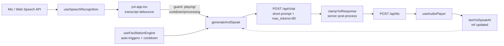
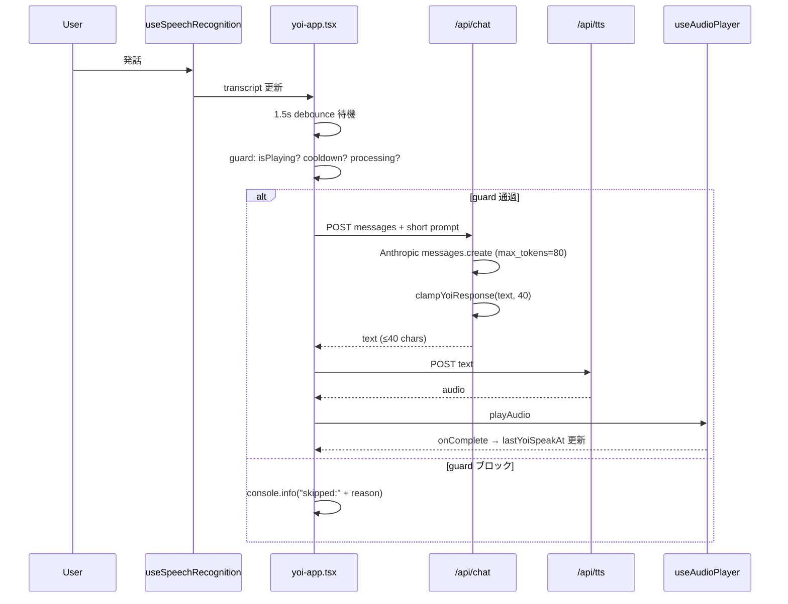
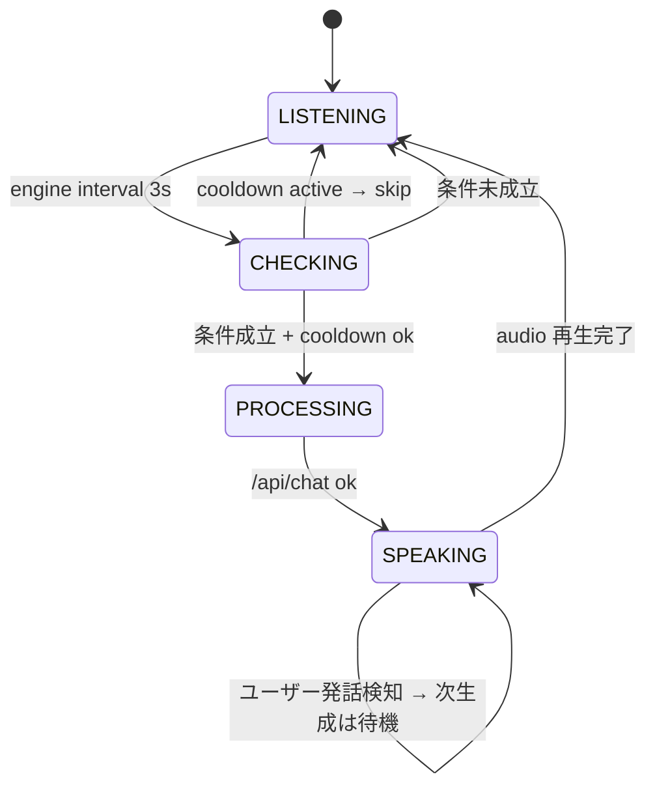

# Technical Design — concise-ai-response

## Overview

**Purpose**: AIファシリテーター「ヨイさん」の発話を「短く・少なく・聞き役に回る」ように調整し、参加者が主役の会話体験を取り戻す。
**Users**: 飲み会中の参加者（話しづらさの解消）と、体験をチューニングする開発者。
**Impact**: サーバー側の応答生成（`/api/chat`）で長さを強制し、クライアント側（`yoi-app.tsx` と `useFacilitationEngine`）で発話頻度と聞き役挙動を制御する。現状のリアルタイム音声対話パイプライン上に最小侵襲な調整として載せる。

### Goals
- 1発話あたり約40文字以内に収め、前置き相槌を排除する。
- ユーザーが話している最中・直後に割り込まず、一定時間の無音を確認してから応答する。
- 直近時間内に AI が発話した回数を上限で制限し、人間同士の会話を優先する。
- 長さ・クールダウン・デバウンスの閾値を `FacilitationConfig` に集約してチューニング容易にする。

### Non-Goals
- LLM モデルの置き換え（引き続き Claude Sonnet 4 を使用）。
- 音声認識エンジンや TTS の差し替え。
- 発話量バランスの本格的な解析（VAD/話者識別などの機能追加）。
- 環境変数による動的設定化（ハッカソン範囲ではコード定数で十分）。

## Architecture

### Existing Architecture Analysis
- **会話ループ**: `useSpeechRecognition` → `yoi-app.tsx` のデバウンス → `POST /api/chat` → `POST /api/tts` → `useAudioPlayer` → 再び `LISTENING`。
- **自動介入**: `useFacilitationEngine` が 3秒間隔で閾値を評価し、`SILENCE_KILLER` / `PASS_TO_PARTICIPANT` / `BREAK_SUGGEST` / `GO_HOME_REMIND` を発火。`isProcessing || isPlaying` で抑制。
- **設定ハブ**: `FacilitationConfig`（`session-state-provider.tsx`）にファシリテーションの閾値が集約されており、そこを拡張するのが自然。
- **技術的制約**: `src/app/api/chat/route.ts` は `anthropic.messages.create` を直接呼ぶ。応答テキストは1箇所で組み立てられるため、後処理の導入が容易。

### Architecture Pattern & Boundary Map



**Architecture Integration**:
- **Selected pattern**: 既存の hooks ベース構成を維持した**拡張レイヤー**。新規コンポーネントは追加せず、「応答長ガード（サーバー）」「発話ゲート（クライアント）」の2関心事を既存モジュール内部に注入する。
- **Domain/feature boundaries**: 応答長 = サーバー `route.ts` の責務、発話ゲート/クールダウン = クライアントの `generateAndSpeak` と `useFacilitationEngine` の責務。
- **Existing patterns preserved**: Route Handler での単発 Anthropic 呼び出し、`useRef` による非同期ステート管理、`FacilitationConfig` による設定集約。
- **New components rationale**: `clampYoiResponse`（純粋関数）を `src/lib/yoi-response.ts` に新設し、切り詰めロジックをテスト可能にする。それ以外は既存ファイルへの修正。
- **Steering compliance**: `tech.md`（Anthropic SDK 直接利用・Server Components デフォルト・`src/lib/` 集約）に準拠。

### Technology Stack & Alignment

| Layer | Choice / Version | Role in Feature | Notes |
|-------|------------------|-----------------|-------|
| Frontend / CLI | React 19 + Next.js 16 Client Component | `generateAndSpeak` のガード、クールダウン管理、設定参照 | 既存 `yoi-app.tsx` を編集 |
| Backend / Services | Next.js Route Handler (`/api/chat`) + `@anthropic-ai/sdk` | プロンプト強化、`max_tokens` 削減、応答切り詰め | `claude-sonnet-4-20250514` 継続 |
| Shared Lib | `src/lib/yoi-response.ts`（新規） | `clampYoiResponse(text, maxChars)` 純粋関数 | テスト容易 |
| State | React Context `SessionStateProvider` | `FacilitationConfig` に新フィールド追加 | デフォルト値集約 |
| Infrastructure / Runtime | Vercel Fluid Compute (Node.js) | 変更なし | — |

## System Flows

### Flow 1: ユーザー発話 → 短い応答



### Flow 2: 自動介入とクールダウン



**Flow notes**:
- `generateAndSpeak` 先頭の複合ガードが単一の合流点として全経路を保護する。
- クールダウンはフロント側の単一 `lastYoiSpeakAtRef` で判定し、自動介入・ユーザー応答どちらも同じ基準。

## Requirements Traceability

| Requirement | Summary | Components | Interfaces | Flows |
|-------------|---------|------------|------------|-------|
| 1.1 | 1発話を約40字以内 | `/api/chat`, `clampYoiResponse` | `POST /api/chat` | Flow 1 |
| 1.2 | 短文指示をシステムプロンプトに含める | `/api/chat` `YOI_SYSTEM_PROMPT` | — | Flow 1 |
| 1.3 | `max_tokens` 上限化 | `/api/chat` | `anthropic.messages.create` | Flow 1 |
| 1.4 | 超過時の自然な切り詰め | `clampYoiResponse` | `(text, maxChars) => string` | Flow 1 |
| 1.5 | 前置き相槌・箇条書き禁止 | `YOI_SYSTEM_PROMPT` | — | Flow 1 |
| 2.1 | 発話中は生成しない | `yoi-app.tsx` transcript debounce | `generateAndSpeak` guard | Flow 1 |
| 2.2 | 無音デバウンス後に生成 | `yoi-app.tsx` | `transcriptDebounceMs` | Flow 1 |
| 2.3 | 直前発話からクールダウン | `yoi-app.tsx` `lastYoiSpeakAtRef` | `aiCooldownSec` | Flow 1, 2 |
| 2.4 | 会話が弾んでいれば自動介入しない | `useFacilitationEngine` | cooldown check | Flow 2 |
| 2.5 | 再生中は次生成を待機 | `yoi-app.tsx` | `isPlaying` guard | Flow 1 |
| 3.1 | 時間あたり発話回数を制限 | `yoi-app.tsx` | `aiCooldownSec` | Flow 2 |
| 3.2 | クールダウン中の自動介入スキップ | `useFacilitationEngine` / `generateAndSpeak` | guard | Flow 2 |
| 3.3 | バランス良好時は閾値引き上げ | `useFacilitationEngine` | `passIntervalSec` の動的適用 | Flow 2 |
| 3.4 | 連続要求のマージ/キャンセル | `yoi-app.tsx` | debounce + guard | Flow 1 |
| 4.1 | 閾値を1箇所に集約 | `SessionStateProvider` `DEFAULT_FACILITATION_CONFIG` | — | — |
| 4.2 | コード変更のみで再デプロイ可能 | 定数のみ、環境変数化しない | — | — |
| 4.3 | 生成/抑制理由をログ | `/api/chat`, `generateAndSpeak` | `console.info/warn` | Flow 1, 2 |
| 4.4 | 切り詰め発生時ログ | `clampYoiResponse` 呼び出し箇所 | `console.info` | Flow 1 |

## Components and Interfaces

| Component | Domain/Layer | Intent | Req Coverage | Key Dependencies | Contracts |
|-----------|--------------|--------|--------------|------------------|-----------|
| `clampYoiResponse` | shared lib | AI応答文字列を自然な文末で切り詰める純粋関数 | 1.1, 1.4, 4.4 | なし | Service |
| `/api/chat` Route Handler | backend | プロンプト強化・max_tokens削減・切り詰め適用 | 1.1–1.5, 4.3, 4.4 | `anthropic` (P0), `clampYoiResponse` (P0) | API |
| `FacilitationConfig` 拡張 | state | 閾値の単一集約（maxResponseChars/aiCooldownSec/transcriptDebounceMs） | 4.1, 4.2 | — | State |
| `generateAndSpeak` guard | frontend | 全経路の合流点で発話ゲートを適用 | 2.1, 2.3, 2.5, 3.1, 3.2, 3.4, 4.3 | `useAudioPlayer`, `FacilitationConfig` (P0) | State |
| `useFacilitationEngine` cooldown | frontend | クールダウン中の自動介入スキップ・バランス時の閾値引き上げ | 2.4, 3.2, 3.3 | `FacilitationConfig` (P0) | State |

### Shared Lib

#### clampYoiResponse

| Field | Detail |
|-------|--------|
| Intent | AI応答を自然な文末で最大N文字に切り詰める純粋関数 |
| Requirements | 1.1, 1.4, 4.4 |

**Responsibilities & Constraints**
- 文字数は「日本語1文字=1」として `Array.from(text).length` で数える（サロゲートペア安全）。
- `maxChars` 以内なら原文を返す。超過時は句点/感嘆符/疑問符/波ダッシュの直後で打ち切り。見つからなければ `maxChars` で切り、末尾に `…` を付与。
- 切り詰めたか否かを戻り値で示す。

##### Service Interface
```typescript
// src/lib/yoi-response.ts
export interface ClampResult {
  text: string;
  truncated: boolean;
  originalLength: number;
}

export function clampYoiResponse(
  text: string,
  maxChars: number
): ClampResult;
```
- Preconditions: `maxChars >= 10`
- Postconditions: `Array.from(result.text).length <= maxChars`（`…` 付与時も含む）
- Invariants: 入力文字列を直接変更しない

**Implementation Notes**
- Integration: `/api/chat` の応答テキスト組み立て直後に呼び出す。
- Validation: 不正な `maxChars` はフォールバックで既定値 40。
- Risks: 句読点がない応答での末尾 `…` 付与が不自然になる可能性 → 軽微として許容。

### Backend

#### `/api/chat` Route Handler

| Field | Detail |
|-------|--------|
| Intent | プロンプト強化・`max_tokens` 削減・応答切り詰めを適用する |
| Requirements | 1.1–1.5, 4.3, 4.4 |

**Responsibilities & Constraints**
- `YOI_SYSTEM_PROMPT` を更新し、長さ・前置き相槌・箇条書き禁止を**強調**する。
- `max_tokens` を 150 → 80 に削減。
- 応答本文に `clampYoiResponse(text, maxResponseChars=40)` を適用して返す。
- 切り詰め発生時は `console.info("yoi.response.truncated", { originalLength })` を出力する。

**Dependencies**
- External: `@anthropic-ai/sdk` — Claude Sonnet 4 呼び出し（P0）
- Internal: `clampYoiResponse`（P0）

**Contracts**: [x] API

##### API Contract
| Method | Endpoint | Request | Response | Errors |
|--------|----------|---------|----------|--------|
| POST | `/api/chat` | `ChatRequest`（既存と同一） | `{ text: string, truncated?: boolean }` | 500 |

Request 型は現行のまま（`message`, `participants`, `recentMessages`, `triggerType`, `triggerContext`）。Response は後方互換を保つため `truncated` を optional 追加のみとする。

**Implementation Notes**
- システムプロンプト例（最終文面はコード側で管理）:
  > 必ず**日本語の1文、40文字以内**で応答する。前置きの相槌（「なるほど〜」等）は禁止。箇条書き・長い解説・複数文は禁止。短く、テンポよく。
- `max_tokens` は 80。
- `anthropic.messages.create` の戻りテキスト後に `clampYoiResponse` を適用。
- エラーパスは既存実装を踏襲。

### Frontend

#### `generateAndSpeak` guard（`yoi-app.tsx` 改修）

| Field | Detail |
|-------|--------|
| Intent | 全トリガー経路の合流点で発話ゲート（processing/playing/cooldown）を適用する |
| Requirements | 2.1, 2.3, 2.5, 3.1, 3.2, 3.4, 4.3 |

**Responsibilities & Constraints**
- 既存の `isProcessingRef` に加え、`lastYoiSpeakAtRef: MutableRefObject<number>` を新設。
- 関数先頭で以下を順に判定し、該当すれば早期 return かつ `console.info("yoi.generateAndSpeak.skipped", { reason })`：
  1. `isProcessingRef.current` → `"processing"`
  2. `isPlaying` → `"speaking"`
  3. `Date.now() - lastYoiSpeakAtRef.current < aiCooldownSec * 1000` → `"cooldown"`
- `useAudioPlayer.onComplete` で `lastYoiSpeakAtRef.current = Date.now()` を更新。
- `transcriptDebounceMs` は `FacilitationConfig` から取得（ハードコード値を置換）。

##### State Management
- State model: `lastYoiSpeakAtRef`（`number`, unix ms）、初期値 `0`。
- Persistence & consistency: インメモリ、セッション終了で破棄。
- Concurrency strategy: React ref のため同期的に読み書き。

**Implementation Notes**
- Integration: `generateAndSpeak` のガード、`useFacilitationEngine` への `isProcessing` プロップに既存ロジックを維持。
- Validation: ガード条件は数値比較のみで単純。
- Risks: `onComplete` が呼ばれない TTS 失敗パスでもクールダウンを意図通り進めるため、`catch` ブロック内でも `lastYoiSpeakAtRef` を更新する。

#### `useFacilitationEngine` cooldown / balance

| Field | Detail |
|-------|--------|
| Intent | 直近 AI 発話からのクールダウン中は自動介入をスキップし、発話バランスが取れている間は発火閾値を引き上げる |
| Requirements | 2.4, 3.2, 3.3 |

**Responsibilities & Constraints**
- `FacilitationEngineOptions` に `lastYoiSpeakAt: number` と `aiCooldownSec: number` を追加。
- チェックループ冒頭で `now - lastYoiSpeakAt < aiCooldownSec * 1000` なら `return`（ログ出力）。
- 「会話が弾んでいる」判定は現状の `lastSpeechTime` を再利用：直近 5秒以内に発話があれば自動介入（`SILENCE_KILLER` を除く）の発火閾値を 1.5倍に引き上げる軽量ヒューリスティック。
- 既存の `SILENCE_KILLER` 自己クールダウンは維持。

##### State Management
- State model: props 経由で受け取る ref 読み出し、内部 refs は既存のまま。
- Concurrency strategy: 変更なし。

**Implementation Notes**
- Integration: `yoi-app.tsx` から `lastYoiSpeakAt={lastYoiSpeakAtRef.current}` と `aiCooldownSec={state.facilitationConfig.aiCooldownSec}` を渡す。
- Risks: ref 経由で props に渡すと再レンダリングが走らない点は `setInterval` 内で常に最新値を参照するため問題なし。

### State

#### `FacilitationConfig` 拡張

| Field | Detail |
|-------|--------|
| Intent | 長さ・クールダウン・デバウンスの閾値を集約し、コード1箇所でチューニングする |
| Requirements | 4.1, 4.2 |

##### State Management
```typescript
export interface FacilitationConfig {
  silenceThresholdSec: number;        // 既存
  passIntervalSec: number;            // 既存
  breakIntervalMin: number;           // 既存
  kanpaiBreakThreshold: number;       // 既存
  maxResponseChars: number;           // 新規: 40
  aiCooldownSec: number;              // 新規: 15
  transcriptDebounceMs: number;       // 新規: 1500
}

const DEFAULT_FACILITATION_CONFIG: FacilitationConfig = {
  silenceThresholdSec: 30,
  passIntervalSec: 60,
  breakIntervalMin: 30,
  kanpaiBreakThreshold: 3,
  maxResponseChars: 40,
  aiCooldownSec: 15,
  transcriptDebounceMs: 1500,
};
```

- Persistence & consistency: インメモリの React state。
- 環境変数化はしない（要件4.2: コード変更のみで再デプロイ可能）。

## Data Models

本機能はデータ永続化を伴わないため、Domain/Logical/Physical Model セクションは省略する。Request/Response スキーマは「/api/chat Route Handler」セクションを参照。

## Error Handling

### Error Strategy
- **LLM応答生成失敗**: 既存通り 500 を返し、クライアントは `fetchWithRetry` 経由で 3 回再試行。最終失敗時は `catch` で `isProcessingRef` と `lastYoiSpeakAtRef` をクリアし、LISTENING に復帰。
- **切り詰めに起因する異常（`Array.from` 失敗等）**: `clampYoiResponse` は防御的に try/catch を設けず、入力が妥当な `string` であることを TypeScript で保証。想定外ケースは原文を返すフォールバック。
- **TTS 失敗**: 既存のテキストのみフォールバック経路を維持し、`catch` 節で `lastYoiSpeakAtRef.current = Date.now()` を必ず更新してクールダウンをずらす。

### Error Categories and Responses
- **User Errors (4xx)**: 対象外（入力は内部モジュール間のみ）。
- **System Errors (5xx)**: Anthropic API 失敗は既存ロジックのまま。
- **Business Logic**: ガード抑制は「エラー」ではなく `console.info` レベルのスキップとして扱う。

### Monitoring
- サーバー: `console.info("yoi.chat.generated", { chars, truncated })`、`console.info("yoi.response.truncated", { originalLength })`。
- クライアント: `console.info("yoi.generateAndSpeak.skipped", { reason })`、`console.info("yoi.facilitation.cooldown", { sinceLastSpeakMs })`。
- 既存の `console.error` は維持。

## Testing Strategy

### Unit Tests
- `clampYoiResponse`:
  1. 閾値以内ならそのまま返す
  2. 句点で切り詰められる
  3. 句読点が無い場合 `…` が付与される
  4. サロゲートペア（絵文字）で文字数が破綻しない
- `/api/chat` route (既存テスト更新): `max_tokens: 80` とシステムプロンプト更新、`truncated` フィールドの存在確認。

### Integration Tests
- `yoi-app` ガード挙動:
  1. `isPlaying=true` 中に `generateAndSpeak` が呼ばれてもスキップされる
  2. クールダウン中の再呼び出しがスキップされる
  3. `onComplete` 後に `lastYoiSpeakAtRef` が更新される（`useAudioPlayer` モック）
- `useFacilitationEngine`:
  1. クールダウン中は `SILENCE_KILLER` も発火しない
  2. 直近発話ありで `passIntervalSec` が引き上がる

### E2E / Manual
- 実機（Chrome Desktop / iOS Safari）でデモシナリオ（乾杯→雑談→沈黙→復帰）を実施し、
  - ヨイさんの応答が 1文/40字以内に収まる
  - ユーザー発話直後に 1.5秒以内で割り込まない
  - 連続 AI 応答が 15秒以内に発生しない
  を目視/ログで確認。

### Performance
- `max_tokens: 80` 化によるレイテンシ短縮を `POST /api/chat` のレスポンスタイムで確認（体感向上の期待）。

## Performance & Scalability

- `max_tokens` 削減（150→80）で LLM 推論時間が短縮され、体感レイテンシが改善する見込み。
- クールダウンとデバウンスで API 呼び出し頻度自体が抑えられ、Vercel Fluid Compute 上のコールドパス負荷を軽減。
- スケール面の新規懸念はなし。

## Supporting References
- 詳細な調査過程・代替案比較は `.kiro/specs/concise-ai-response/research.md` を参照。
