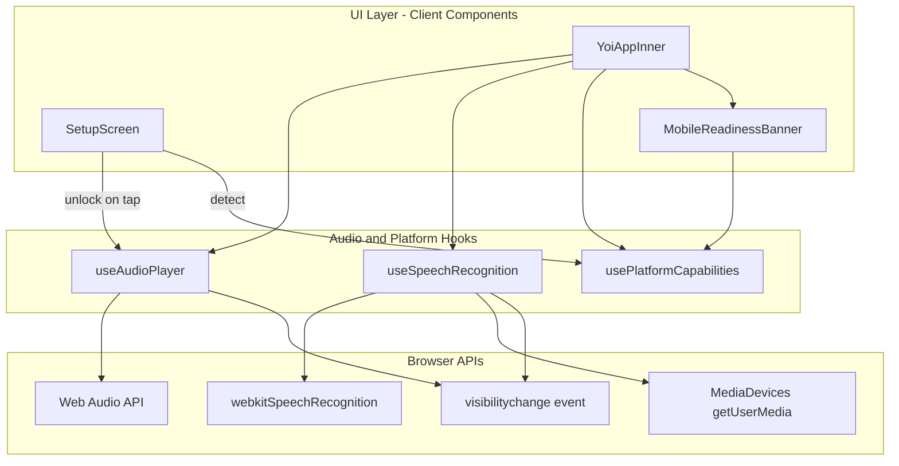
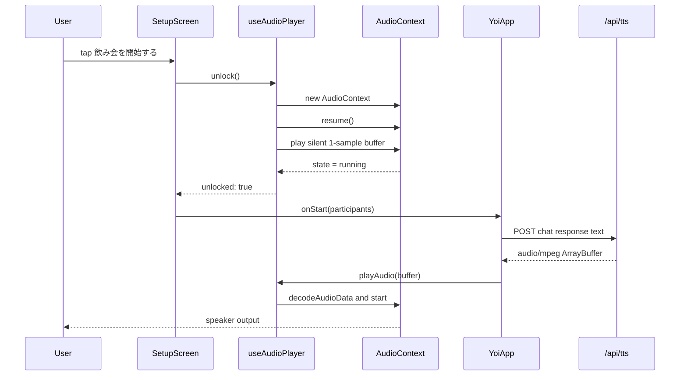
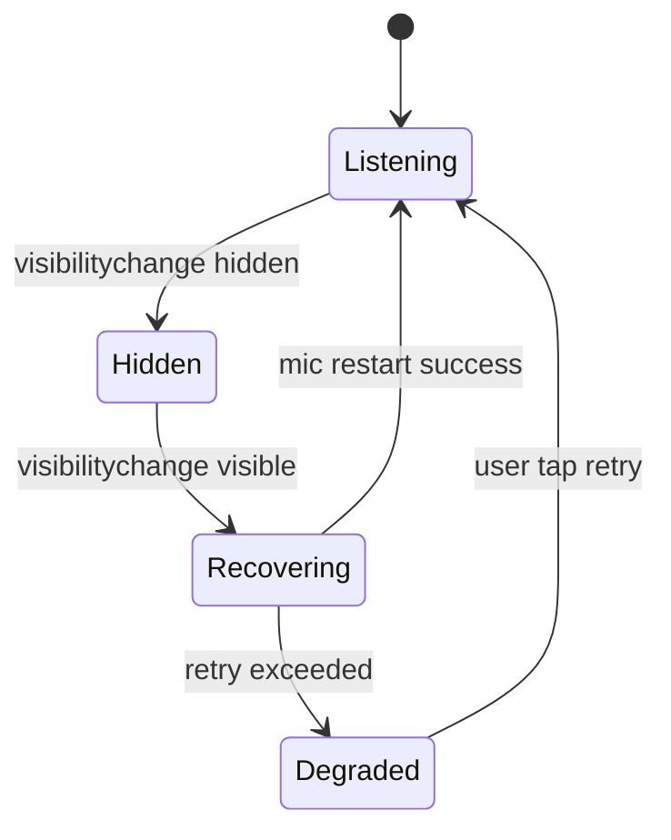

# Technical Design — mobile-responsive

## Overview

**Purpose**: 本機能は、AI幹事「ヨイさん」アプリをスマートフォン（iOS Safari / Android Chrome）で実用可能にするモバイル対応拡張である。最優先課題は、iOS/Android のオートプレイ制限により `AudioContext` がユーザージェスチャー外で初期化されているため TTS 音声が再生されない事象の解消である。
**Users**: 飲み会参加者がスマートフォンでアプリにアクセスし、デスクトップ同等のヨイさんファシリテーション体験を享受する。
**Impact**: 既存の `useAudioPlayer`・`useSpeechRecognition`・`YoiApp`・`SetupScreen` を最小限の境界追加で拡張し、オーディオ unlock 責務と dynamic viewport ベースのレイアウト基盤を導入する。

### Goals
- モバイルブラウザで TTS 音声が確実にスピーカーから再生される（Requirement 1）
- モバイルでマイク権限取得とエコー抑制が機能し、縮退モードを提供する（Requirement 2）
- 縦持ちスマートフォンで UI が崩れず、タッチ操作が快適である（Requirement 3）
- モバイル固有のエラーとフォールバックをユーザーに明示する（Requirement 5）

### Non-Goals
- ネイティブアプリ化・PWA インストール対応
- デスクトップ UI の全面リデザイン
- Web Speech API 非対応ブラウザ向けの代替音声認識エンジン導入
- バックグラウンド動作・Picture-in-Picture 対応

## Architecture

### Existing Architecture Analysis
- Next.js 16 App Router + React 19 Client Components 構成で、音声入出力は `src/hooks/` 配下の React Hooks に分離されている。
- `useAudioPlayer` は `playAudio` 呼び出し時点で `AudioContext` を遅延生成しており、TTS API レスポンス受信後のコンテキスト（非ユーザージェスチャー）で初期化されるため、モバイルでは unlock に失敗する。
- レイアウトは `yoi-app.tsx` で `h-screen` (`100vh`) を使用しており iOS Safari のアドレスバー分がはみ出す。
- `useSpeechRecognition` は既に `service-not-available` エラーをハンドルしており、UI 層で Chrome 推奨メッセージを出している。

### Architecture Pattern & Boundary Map



**Architecture Integration**:
- Selected pattern: **Hook拡張パターン**。既存の Hook 境界を保ちつつ `useAudioPlayer` に `unlock()` API を追加し、新規 `usePlatformCapabilities` Hook でプラットフォーム検知を集約する。
- Domain/feature boundaries: オーディオ再生は `useAudioPlayer`、音声認識は `useSpeechRecognition`、プラットフォーム検知は `usePlatformCapabilities` に責務分離。UI 層は Hook が返す状態のみを参照する。
- Existing patterns preserved: `src/lib/` シングルトン、`'use client'` 境界、hooks 単位の単体テスト構成。
- New components rationale: `usePlatformCapabilities` は iOS / Android / Web Speech / Web Audio サポート判定を UI 層から隔離するため新設。`MobileReadinessBanner` は初回ガイダンスとエラーバナー責務を集約する薄い UI コンポーネント。
- Steering compliance: `'use client'` は Hooks と UI 境界に限定、外部サービスは既存 `/api/tts` を継続利用、TypeScript strict のまま `any` を増やさない。

### Technology Stack

| Layer | Choice / Version | Role in Feature | Notes |
|-------|------------------|-----------------|-------|
| Frontend (UI) | React 19 + Tailwind CSS v4 | モバイルレスポンシブレイアウト、`h-dvh` ユーティリティ、Safe Area padding | Tailwind v4 の dynamic viewport utilities を使用 |
| Frontend (Audio) | Web Audio API (既存) | TTS 音声のデコード/再生、ユーザージェスチャー unlock | `AudioContext.resume()` を `click`/`touchend` 同期で実行 |
| Frontend (Speech) | Web Speech API (既存) | 音声認識、モバイル未対応検知 | iOS Safari 17+ は部分サポート、不可時は縮退 |
| Frontend (State) | 既存 `SessionStateProvider` | 変更なし | フェーズ管理は現行ロジックを継続 |
| Backend | `/api/tts`, `/api/chat` (既存) | 変更なし | モバイル固有の API 変更は発生しない |
| Infrastructure | Vercel (既存) | HTTPS 配信下で getUserMedia を許可 | HTTPS 必須であり既存構成で充足 |

> 詳細なブラウザ API 調査と decision rationale は `research.md` を参照。

## System Flows

### AudioContext Unlock Flow (モバイル TTS 再生)



**Key Decisions**:
- Unlock は `SetupScreen` のタップハンドラ同期コールスタック内で実行し、非同期処理を挟まない。
- 以降の `playAudio` は unlock 済み context を再利用し、`suspended` になった場合のみ `resume()` を追加で試みる。

### Visibility / Mic Recovery Flow



## Requirements Traceability

| Requirement | Summary | Components | Interfaces | Flows |
|-------------|---------|------------|------------|-------|
| 1.1 | ユーザージェスチャーで AudioContext unlock | useAudioPlayer, SetupScreen | `unlock(): Promise<UnlockResult>` | AudioContext Unlock Flow |
| 1.2 | unlock 済み context で TTS 再生 | useAudioPlayer, YoiAppInner | `playAudio(buffer)` | AudioContext Unlock Flow |
| 1.3 | suspended 状態の resume と失敗時ガイド | useAudioPlayer, MobileReadinessBanner | `unlock`, `onUnlockFailed` | AudioContext Unlock Flow |
| 1.4 | iOS silent switch への best-effort 配慮 | useAudioPlayer | `playAudio` 内でサイレント検知 | — |
| 1.5 | 再生失敗時の UI 通知と再試行アクション | MobileReadinessBanner, useAudioPlayer | `PlaybackError` state | — |
| 1.6 | 初回失敗時の自動リカバリ | useAudioPlayer | 内部 `recoverOnce` 方針 | — |
| 2.1 | マイク権限取得 | useSpeechRecognition | `startListening()` | Visibility / Mic Recovery Flow |
| 2.2 | Web Speech API 未対応時の縮退 | useSpeechRecognition, usePlatformCapabilities, MobileReadinessBanner | `capabilities.speechRecognition` | — |
| 2.3 | TTS 発話中の自マイクミュート | useAudioPlayer, YoiAppInner | 既存 `stopListening` 連携 | — |
| 2.4 | TTS 完了後の再開 | useAudioPlayer onComplete | 既存 `startListening` コールバック | — |
| 2.5 | バックグラウンド復帰時の再取得 | useSpeechRecognition | `visibilitychange` handler | Visibility / Mic Recovery Flow |
| 3.1 | 320〜430px 幅での主要画面表示 | yoi-app.tsx, setup-screen.tsx, BeerJugVisualizer | Tailwind responsive class | — |
| 3.2 | モバイルブレークポイントで 1 カラム化 | yoi-app.tsx, ChatPanel | レイアウト class の差し替え | — |
| 3.3 | タップターゲット 44px 以上 | MicStatusIndicator, setup-screen.tsx | Tailwind `min-h-11 min-w-11` | — |
| 3.4 | 画面回転追従 | yoi-app.tsx | `h-dvh` + flex | — |
| 3.5 | `dvh`/`svh` ベースの高さ | yoi-app.tsx | `h-dvh` クラス | — |
| 3.6 | Safe Area inset 対応 | yoi-app.tsx footer / header | `pb-[env(safe-area-inset-bottom)]` | — |
| 4.1 | 30fps 以上のアニメーション | BeerJugVisualizer | 変更最小（既存 canvas） | — |
| 4.2 | リソース解放 | useAudioPlayer | `stopAudio`/teardown 強化 | — |
| 4.3 | 回線不安定時リトライ | YoiAppInner (既存 fetchWithRetry) + MobileReadinessBanner | 既存 retry 利用 | — |
| 4.4 | 画面ロック復帰時の状態保持 | SessionStateProvider (変更なし) + useSpeechRecognition | `visibilitychange` | Visibility / Mic Recovery Flow |
| 5.1 | 初回ガイダンス表示 | usePlatformCapabilities, SetupScreen | `capabilities.isMobile` | — |
| 5.2 | 機能欠落時の明示 | MobileReadinessBanner | `capabilities` state | — |
| 5.3 | UI エラーバナー | MobileReadinessBanner | `PlaybackError` / speechError | — |
| 5.4 | デバッグログ | useAudioPlayer | `console.debug` (dev のみ) | — |

## Components and Interfaces

| Component | Domain/Layer | Intent | Req Coverage | Key Dependencies (P0/P1) | Contracts |
|-----------|--------------|--------|--------------|--------------------------|-----------|
| useAudioPlayer (拡張) | Audio Hook | AudioContext unlock、再生、エラー/リカバリ状態の公開 | 1.1, 1.2, 1.3, 1.4, 1.5, 1.6, 2.3, 2.4, 4.2 | Web Audio API (P0), usePlatformCapabilities (P1) | Service, State |
| useSpeechRecognition (拡張) | Speech Hook | マイクストリーム取得、未対応検知、visibilitychange 復帰 | 2.1, 2.2, 2.5, 4.4 | webkitSpeechRecognition (P0), MediaDevices (P0) | Service, State |
| usePlatformCapabilities (新規) | Platform Hook | iOS/Android/Web Audio/Web Speech の対応可否検知 | 2.2, 5.1, 5.2 | navigator (P0) | Service, State |
| MobileReadinessBanner (新規) | UI | モバイル初回ガイダンスとオーディオ/マイクエラー表示 | 1.3, 1.5, 2.2, 5.1, 5.2, 5.3 | usePlatformCapabilities (P0), useAudioPlayer error state (P0) | State |
| SetupScreen (拡張) | UI | ユーザーの最初のタップで `unlock()` を起動 | 1.1, 1.3, 3.3, 5.1 | useAudioPlayer (P0), usePlatformCapabilities (P1) | — |
| YoiAppInner (拡張) | UI Orchestration | モバイルレイアウトと既存フロー統合 | 1.2, 2.3, 2.4, 3.1-3.6, 4.1, 4.3 | 既存 Hooks 群 (P0) | — |
| BeerJugVisualizer / ChatPanel / MicStatusIndicator (調整のみ) | UI | レイアウト classes を `dvh`/1カラム対応に調整 | 3.1, 3.2, 3.3, 3.4 | Tailwind v4 (P1) | — |

### Audio Domain

#### useAudioPlayer (拡張)

| Field | Detail |
|-------|--------|
| Intent | AudioContext の unlock と TTS 再生、エラー/リカバリ状態の公開 |
| Requirements | 1.1, 1.2, 1.3, 1.4, 1.5, 1.6, 2.3, 2.4, 4.2 |

**Responsibilities & Constraints**
- `unlock()` はユーザージェスチャー同期コールスタック内で必ず呼ばれる前提で設計し、`new AudioContext()` + `resume()` + 無音バッファ再生を同期的に発行する。
- `playAudio` は unlock 済み context の再利用を前提とし、遅延生成しない。
- 再生失敗 / unlock 失敗を discriminated union で状態として公開する。
- `stopAudio` および tear down は `AudioBufferSourceNode` のイベントリスナとリファレンスを確実に解放する。

**Dependencies**
- Inbound: `SetupScreen` — unlock 起動 (P0)
- Inbound: `YoiAppInner` — TTS 再生リクエスト (P0)
- Outbound: Web Audio API — context 管理 (P0)
- External: なし

**Contracts**: Service [x] / API [ ] / Event [ ] / Batch [ ] / State [x]

##### Service Interface
```typescript
type UnlockResult =
  | { status: "unlocked" }
  | { status: "failed"; reason: "not-supported" | "resume-rejected" | "unknown"; error?: Error };

type PlaybackError =
  | { type: "decode-failed"; error: Error }
  | { type: "playback-failed"; error: Error }
  | { type: "context-suspended" };

interface AudioPlayerState {
  isPlaying: boolean;
  progress: number;
  isUnlocked: boolean;
  lastError: PlaybackError | null;
}

interface UseAudioPlayerReturn extends AudioPlayerState {
  unlock(): Promise<UnlockResult>;
  playAudio(buffer: ArrayBuffer): Promise<void>;
  stopAudio(): void;
  clearError(): void;
}
```
- Preconditions: `unlock()` はユーザージェスチャー同期文脈で呼ばれる。`playAudio()` は `isUnlocked === true` 後に呼ばれる。
- Postconditions: `unlock()` 成功時 `AudioContext.state === "running"` かつ `isUnlocked = true`。`playAudio()` 完了時 `isPlaying = false` かつ `onComplete` が発火。
- Invariants: 同一インスタンス内の `AudioContext` は最大 1 つ。unlock 済み context は破棄されず再利用される。

##### State Management
- State model: `AudioPlayerState` を `useState` で保持。`lastError` は discriminated union。
- Persistence & consistency: メモリ上のみ。セッション再開時に再 unlock は不要（同一ページ）。
- Concurrency strategy: `playAudio` 呼び出しは常に直前の再生を `stopAudio` で停止してから開始する。

**Implementation Notes**
- Integration: `SetupScreen` の submit ハンドラ内で `await audioPlayer.unlock()` を呼び、`status === "failed"` のとき `MobileReadinessBanner` にエラーを渡して再試行導線を出す。
- Validation: `unlock()` は同一 context を 2 回 unlock しても冪等である。
- Risks: iOS silent switch は Web Audio を強制ミュートする場合があり、unlock 成功＝可聴を保証しない。playback progress の停滞を検知して best-effort で検出する。

### Speech Domain

#### useSpeechRecognition (拡張)

| Field | Detail |
|-------|--------|
| Intent | 音声認識の開始/停止と、モバイル固有のライフサイクル（visibilitychange / バックグラウンド復帰）対応 |
| Requirements | 2.1, 2.2, 2.5, 4.4 |

**Responsibilities & Constraints**
- 既存 API（`startListening`/`stopListening`/`resetTranscript`）のシグネチャを維持する。
- 新たに `visibilitychange` リスナで `document.visibilityState === "visible"` 時に `desiredListeningRef.current` が true なら再起動を最大 3 回リトライ。
- `isSupported === false` の場合、UI 層が縮退モードを選べるよう state に反映。

**Dependencies**
- Inbound: `YoiAppInner` (P0)
- Outbound: `webkitSpeechRecognition`, `navigator.mediaDevices` (P0)
- External: なし

**Contracts**: Service [x] / API [ ] / Event [ ] / Batch [ ] / State [x]

##### Service Interface
```typescript
type SpeechRecognitionErrorType =
  | "not-allowed"
  | "no-speech"
  | "audio-capture"
  | "network"
  | "service-not-available"
  | "mobile-recovery-failed";

interface UseSpeechRecognitionReturn {
  isListening: boolean;
  isSupported: boolean;
  transcript: string;
  interimTranscript: string;
  error: SpeechRecognitionErrorType | null;
  startListening(): void;
  stopListening(): void;
  resetTranscript(): void;
}
```
- Preconditions: HTTPS 下で呼び出される。
- Postconditions: `startListening()` 後に `isListening = true`。`visibilitychange` 復帰時は desired 状態に基づき `isListening` を復元。
- Invariants: 同一インスタンスで `SpeechRecognition` は高々 1 つ。

**Implementation Notes**
- Integration: 既存の `YoiAppInner` からの利用形態を変更しない。`isSupported` と `error` を UI 層が参照し `MobileReadinessBanner` で表示。
- Validation: visibilitychange リトライは 3 回失敗で `error = "mobile-recovery-failed"` を立てる。
- Risks: iOS Safari では `webkitSpeechRecognition` が存在しないため `isSupported = false` となり、縮退 UI を確実に出す必要がある。

### Platform Domain

#### usePlatformCapabilities (新規)

| Field | Detail |
|-------|--------|
| Intent | プラットフォーム種別・Web Audio / Web Speech サポート状況を 1 カ所で判定し、UI/Hook の分岐を単純化する |
| Requirements | 2.2, 5.1, 5.2 |

**Responsibilities & Constraints**
- SSR 安全にするため `typeof window === "undefined"` 時はデフォルト値を返し、マウント後に更新する。
- ユーザーエージェント検知は best-effort（誤検知しても機能劣化なし）。

**Dependencies**
- Inbound: `SetupScreen`, `MobileReadinessBanner`, `YoiAppInner` (P1)
- Outbound: `navigator.userAgent`, `window.AudioContext`, `"webkitSpeechRecognition" in window` (P0)

**Contracts**: Service [x] / State [x]

##### Service Interface
```typescript
type PlatformKind = "ios-safari" | "android-chrome" | "desktop" | "unknown";

interface PlatformCapabilities {
  kind: PlatformKind;
  isMobile: boolean;
  webAudioSupported: boolean;
  webSpeechSupported: boolean;
  requiresUserGestureUnlock: boolean;
}

interface UsePlatformCapabilitiesReturn {
  capabilities: PlatformCapabilities;
}
```
- Invariants: `capabilities` はマウント後不変。

### UI Domain

#### MobileReadinessBanner (新規)

| Field | Detail |
|-------|--------|
| Intent | モバイルユーザーへの初回ガイダンスとオーディオ/マイク関連エラーの可視化 |
| Requirements | 1.3, 1.5, 2.2, 5.1, 5.2, 5.3 |

**Responsibilities & Constraints**
- `PlaybackError`・`SpeechRecognitionErrorType`・`PlatformCapabilities` を受け取り、優先度付きで 1 バナーのみ表示。
- 再試行ボタンを配置し、クリック時に `onRetry` コールバックを発火。

**Dependencies**
- Inbound: `YoiAppInner`, `SetupScreen` (P0)
- Outbound: なし（純 UI）

**Contracts**: State [x]

##### Props Contract
```typescript
interface MobileReadinessBannerProps {
  capabilities: PlatformCapabilities;
  playbackError: PlaybackError | null;
  speechError: SpeechRecognitionErrorType | null;
  onRetryPlayback?: () => void;
  onDismissGuidance?: () => void;
}
```

**Implementation Notes**
- Integration: `yoi-app.tsx` のヘッダー直下に配置。優先度: playback error > speech error > guidance。
- Validation: 同一エラーを連続表示しない dedupe を props 側でハンドル。
- Risks: 画面上部を占有するため、モバイル縦画面での領域圧迫を最小にする（1 行高）。

#### SetupScreen / YoiAppInner / BeerJugVisualizer (レイアウト調整)

| Field | Detail |
|-------|--------|
| Intent | 既存 UI のモバイル縦持ち対応、dvh/Safe Area、タップターゲット最適化 |
| Requirements | 3.1, 3.2, 3.3, 3.4, 3.5, 3.6, 4.1 |

**Implementation Notes**
- `YoiAppInner` ルートの `h-screen` を `h-dvh` へ置換、ヘッダー/フッターに `pt-[env(safe-area-inset-top)]` / `pb-[env(safe-area-inset-bottom)]` 相当の padding を追加。
- `SetupScreen` のタイトル画像と CTA ボタンをモバイル時に縦 1 カラムに揃え、CTA に `min-h-12` を適用。
- `MicStatusIndicator` のタップ領域を最低 44x44 px 確保。
- `BeerJugVisualizer` は canvas サイズを親要素の `ResizeObserver` に基づきリフレッシュし、横幅 320px でも崩れないようにする。

## Data Models

新規永続データは存在しない。以下のセッション内型のみを追加する:

- `PlatformCapabilities` — プラットフォーム検知結果（メモリ）
- `PlaybackError` — 再生エラー discriminated union（メモリ）
- `UnlockResult` — unlock 結果 discriminated union（メモリ）

DB スキーマ / API 契約への変更はなし。

## Error Handling

### Error Strategy
- **ユーザージェスチャー不足 / 自動再生拒否**: `useAudioPlayer.unlock()` が `UnlockResult.failed` を返し、`MobileReadinessBanner` が「画面をタップして音声を有効にしてください」ガイドを表示。再タップで再 unlock 可能。
- **TTS 再生失敗**: `PlaybackError` を state に反映し、バナーで再試行ボタンを提示。内部で 1 回だけ `AudioContext` 再生成リトライ（Requirement 1.6）。
- **マイク権限拒否 / 未対応**: 既存 `speechError` と新 `mobile-recovery-failed` を統一バナーで表示し、縮退モード（テキスト入力 or ボタン操作）を案内。
- **ネットワーク失敗**: 既存 `fetchWithRetry` を継続利用。最終失敗時にバナー通知。

### Error Categories and Responses
- **User Errors**: 操作案内（タップ促し、マイク許可ダイアログ再表示）。
- **System Errors**: TTS / LLM API 失敗時はバナー + リトライ。
- **Business Logic Errors**: 対象外（本機能では発生しない）。

### Monitoring
- `console.debug` レベルで `AudioContext.state`、`unlock` 成否、`visibilitychange` recovery 回数を出力（dev のみ）。
- 本番では既存の Vercel ログに TTS/Chat API 失敗が記録される（既存通り）。

## Testing Strategy

### Unit Tests
1. `useAudioPlayer.unlock()` がユーザージェスチャー後に `AudioContext` を生成し `isUnlocked=true` に遷移する
2. `useAudioPlayer.playAudio()` が unlock 済み context を再利用し、`decodeAudioData` 失敗時に `PlaybackError` を state に反映する
3. `usePlatformCapabilities` が iOS Safari / Android Chrome / デスクトップの UA を正しく分類する
4. `useSpeechRecognition` の `visibilitychange` ハンドラが `visible` 復帰時に `startListening` を再試行する
5. `useAudioPlayer.stopAudio()` が `AudioBufferSourceNode` のリスナを解放する（メモリリーク回帰防止）

### Integration Tests
1. `SetupScreen` のフォーム送信で `unlock()` が呼ばれ、結果が `YoiAppInner` に伝搬する
2. `YoiAppInner` が TTS API レスポンス受信後、unlock 済み context で `playAudio` を呼び出す
3. Web Speech API 未サポート時、`MobileReadinessBanner` が縮退メッセージを表示する

### E2E/UI Tests (手動)
1. iPhone 15 / iOS 17 Safari 実機で「飲み会を開始する」→ TTS が可聴で再生される
2. Pixel / Android Chrome 実機で音声認識と TTS が同時に機能する
3. iPhone 縦持ち 390px 幅でヘッダー/フッター/ビールジョッキが画面内に収まる
4. 端末ロック→解除で音声認識が自動復帰する
5. iOS silent switch ON 時にサイレント解除ガイドが表示される

### Performance / Load
1. ビールジョッキアニメーションが Android 中級機で 30fps 以上
2. 30 分連続セッションでメモリ消費が線形に増加しない（Chrome DevTools Memory profile）

## Performance & Scalability

- モバイル GPU 負荷軽減のため、`BeerJugVisualizer` の canvas サイズは `min(width, 300px)` に制限する方針を推奨。
- `AudioContext` の `latencyHint: "playback"` を指定し、モバイルでのバッテリー効率を優先する。
- 追加ネットワーク呼び出しは発生しない。

## Security Considerations

- `getUserMedia` は HTTPS 下でのみ動作する。Vercel 本番 URL が HTTPS である前提を維持。
- プラットフォーム検知は `navigator.userAgent` を参照するのみで、PII は扱わない。
- モバイルデバッグログには個人情報を含めない（`console.debug` は AudioContext 状態と boolean のみ）。

## Supporting References

- `research.md` — 調査ログと決定理由
- `.kiro/steering/tech.md` — 使用技術スタックのベースライン
- `src/hooks/use-audio-player.ts` — 現行実装の起点
- `src/hooks/use-speech-recognition.ts` — 既存音声認識ロジック
- `src/components/yoi-app.tsx` — 既存 orchestration
